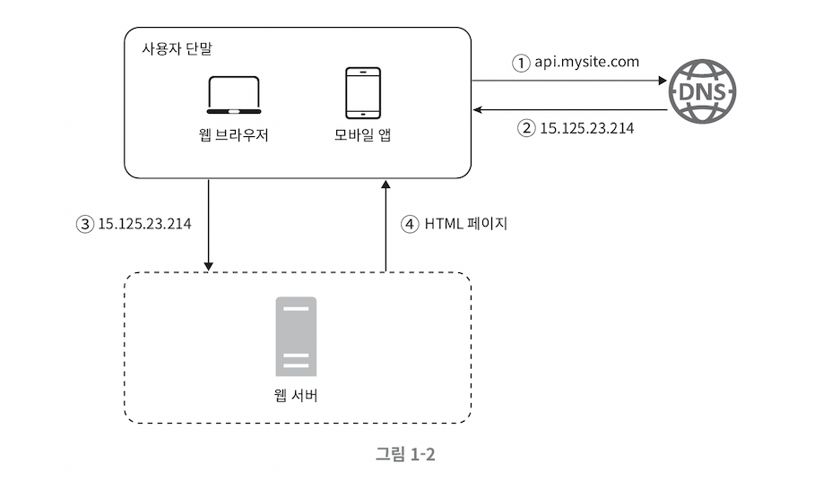

# 단일서버

> 웹, 앱, 데이터베이스, 캐시 등이 전부 서버 한 대에서 실행되는 간단한 시스템

### 사용자 요청 처리 흐름

1. 사용자는 **도메인 이름**을 이용하여 웹사이트에 접속한다.

    - 접속을 위해서 도메인 이름을 도메인 이름 서비스에 질의하여 **IP 주소로 변환**하는 과정 필요
    - DNS 는 제3 사업자`third party` 가 제공하는 유료 서비스를 이용하게 된다. _(설계 범위 밖)_

2. DNS 조회 결과로 **IP 주소가 반환**된다.

    - 웹 서버의 주소

3. 해당 IP 주소로 HTTP 요청이 전달된다.

    - **HTTP**: `HyperText Transfer Protocol`

4. 요청을 받은 웹 서버는 `HTML페이지`/`JSON` 형태의 응답을 반환한다.

 

## 실제 요청의 출처 - 웹 / 앱

### 웹 애플리케이션

1. **비즈니스 로직, 데이터 저장** 등
    - 서버 구현용 언어 사용
    - 자바, 파이썬
2. **프레젠테이션** 용
    - 클라이언트 구현용 언어 사용
    - HTML, 자바스크립트 등

### 모바일 앱

1. 모바일 앱과 웹 서버 간 통신을 위해 **HTTP 프로토콜** 이용
2. 응답 데이터 포맷
    - **JSON** `JavaScript Object Notation`
    - 간결함
