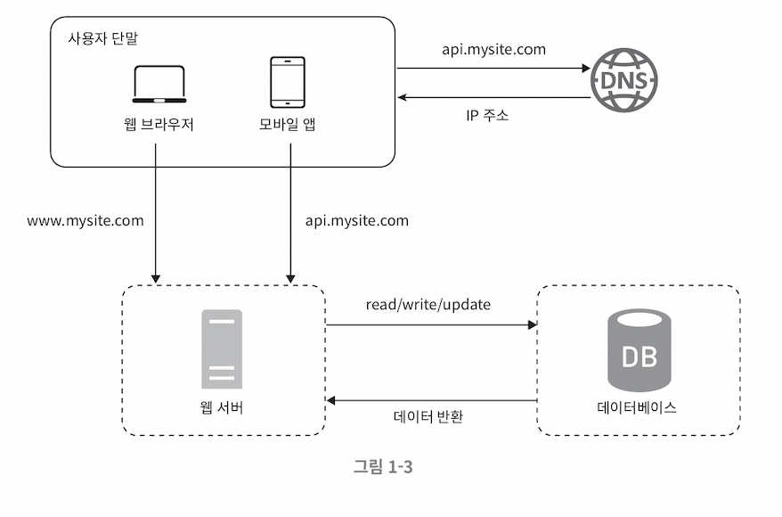

# 데이터베이스

### 사용자 수 증가에 따른 서버 분리

1. 웹/모바일 트래픽 처리 용도
2. 데이터베이스 용도

> 웹 계층과 데이터 계층을 분리하여 그 각각을 독립적으로 확장해 나간다.

 

## 관계형 데이터베이스와 비-관계형 데이터베이스

### relational database, RDB

> 관계형 데이터베이스

-   Relational Data-base Management System, RDBMS 라고도 불린다.
-   SQL 을 사용하여 여러 테이블에 있는 데이터를 그 관계에 따라 **조인** 하여 합칠 수 있다.
-   자료를 테이블과 열, 칼럼으로 표현

 

### NoSQL

> 비-관계형 데이터베이스

-   `CouchDB`, `Neo4j`, `Cassandra`, `HBase`, `Amazon DynamoDB`
-   저장 형태에 따른 분류
    -   키-값 저장소 **`key-value store`**
    -   그래프 저장소 **`graph store`**
    -   칼럼 저장소 **`column store`**
    -   문서 저장소 **`document store`**
-   일반적으로 조인 연산은 지원하지 않는다.

 

### 비-관계형 데이터 베이스가 유용한 서비스 조건

-   **_아주 낮은 응답 지연시간latency_** 이 요구된다
-   다루는 **_데이터가 비정형unstructured_** 즉, 관계형 데이터가 아니다
-   데이터를 **_직렬화하거나 역직렬화_** 할 수 있기만 하면 된다
    -   Json, yaml, xml 등…
-   **_아주 많은 양의 데이터_** 를 저장할 필요가 있다.
