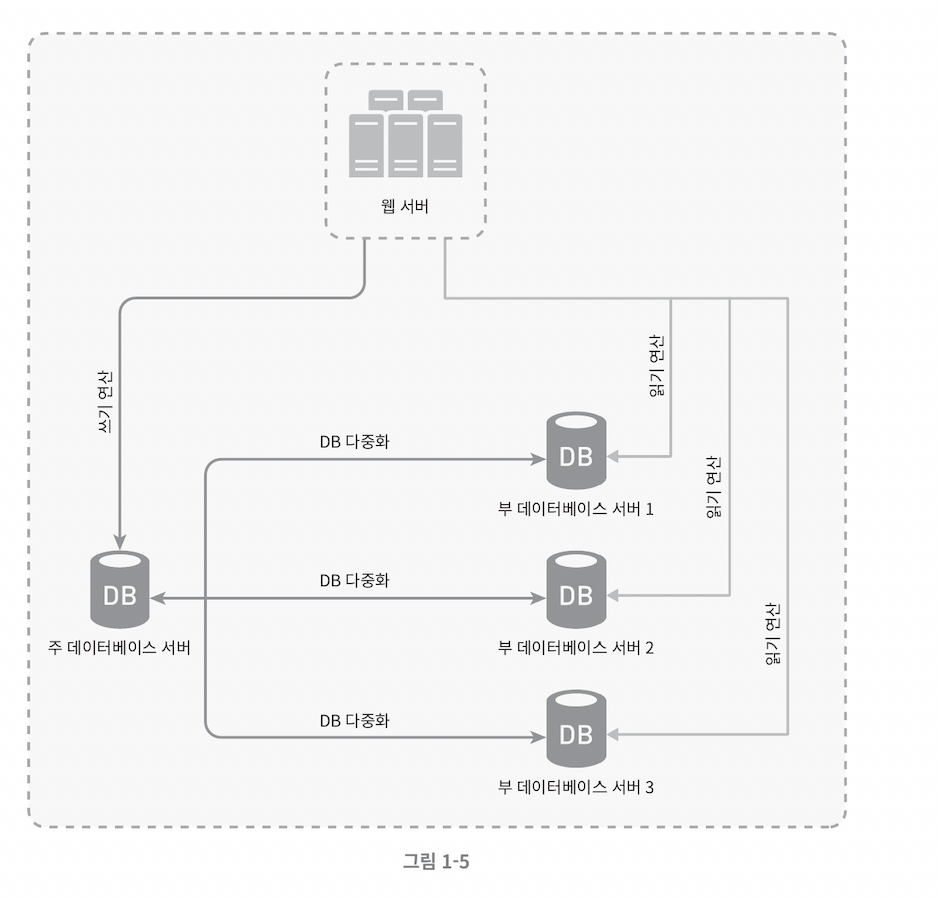
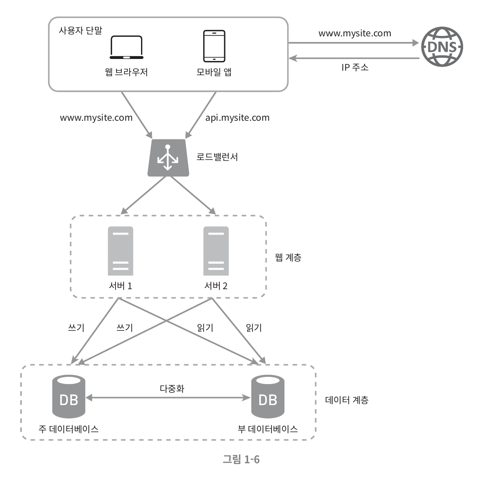

# 데이터베이스 다중화

> 많은 데이터베이스 관리 시스템이 다중화를 지원한다. 보통은 서버 사이에 주(master) - 부(slave) 관계를 설정하고 데이터 원본은 주 서버에, 사본은 부 서버에 저장하는 방식이다.

## 쓰기 연산, write operation

-   `마스터` 에서만 지원
-   데이터베이스 변경 명령어
    -   instert, delete, update …
    -   해당 명령들은 주 데이터베이스로만 전달

## 읽기 연산, read operation

-   `부 데이터베이스` 에서 지원
-   주 데이터베이스로부터 사본을 전달받아 읽기 연산만을 지원
-   **대부분 애플리케이션은 읽기 연산 비중이 쓰기 연산보다 월등히 높다.**

⇒ **주 데이터베이스**보다 **부 데이터베이스**를 많이 배치

### 데이터베이스 다중화 이득

1. 더 나은 성능
    - 주-부 다중화 모델에서 모든 데이터 변경 연산은 주 데이터베이스 서버로만 전달된다.
    - 읽기 연산은 부 데이터베이스 서버들로 분산
    - 병렬 처리될 수 있는 질의query 수가 늘어나 성능이 좋아진다.
2. 안정성reliability
    - 자연 재해 등의 이유로 DB 서버 가운데 일부가 파손되어도 데이터는 보존될 것
        - 데이터를 지역적으로 떨어진 여러 장소에 다중화시켜 놓을 수 있기 때문
3. 가용성 availability
    - 데이터를 여러 지역에 복제
    - → 데이터 베이스 서버에 장애가 발생해도, 다른 서버의 데이터를 가져와 계속 서비스 제공 가능

## wht if, DB 서버 중 하나가 다운된다면?

### 부 서버 한대 다운

-   읽기 연산은 한시적으로 주 데이터베이스로 모두 전달
    -   즉시 새로운 부 데이터베이스 서버가 장애 서버 대체
    -   부 서버가 여러 대인 경우 읽기 연산은 나머지 부 데이터베이스 서버들로 분산
    -   새로운 부 데이터베이스 서버가 장애 서버 대체

### 주 데이터베이스 서버 다운

1. **한 대의 부 데이터베이스만 있는 경우**
    - 해당 부 데이터베이스 서버가 새로운 주 서버 역할 수행
    - 모든 DB 연산은 일시적으로 새로운 주 DB 서버에서 수행
    - 새로운 부 서버 추가 예정

 

2.  **프로덕션production 환경**
    -   부 서버에 보관된 데이터가 최신 상태가 아닐 수 있다.
        -   없는 데이터는 복구 스크립트를 통해 추가
            -   recovery script
        -   다중 마스터`multi-masters`나 원형 다중화`circular replication` 방식 이용 시 원활한 대처 가능
            -   참고문헌4/5

### 데이터베이스 다중화에서 사용자 요청 처리 흐름

1. 사용자는 DNS 로부터 로드밸런서의 공개 IP 주소를 받는다.
2. 사용자는 해당 IP 주소를 사용해 로드밸런서에 접속한다.
3. HTTP 요청은 서버 1이나 서버 2로 전달된다.
4. 웹 서버는 사용자의 데이터를 부 데이터베이스 서버에서 읽는다.
5. 웹 서버는 데이터변경 연산은 주 데이터베이스로 전달한다.
    - 데이터 추가, 삭제, 갱신 연산 등…
