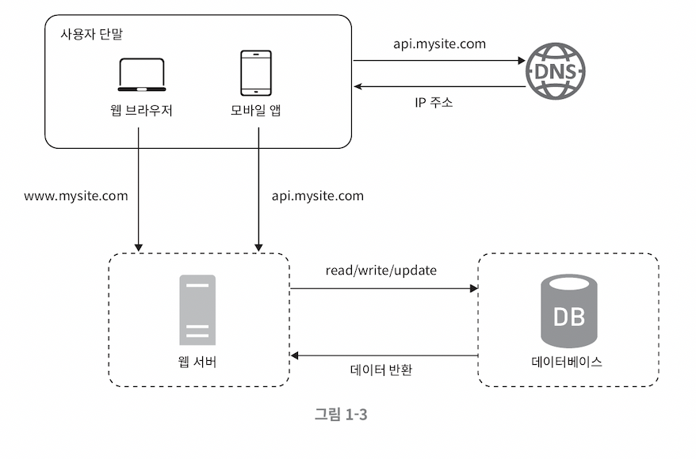
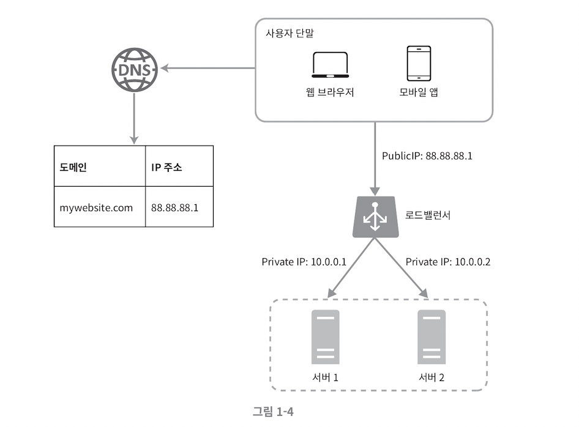

# 수직적 규모 확장 vs 수평적 규모 확장

### 스케일 업scale up

-   수직적 규모 확장 프로세스 `vertical scaling`
-   서버에 **고사양 자원**을 추가하는 행위
    -   더 좋은 CPU, 더 많은 RAM
-   한계
    -   한대의 서버에 CPU 나 메모리를 무한대로 증설할 방법은 없다.
    -   수직적 규모 확장법에는 장에에 대한 자동복구failover 방안이나 다중화redundancy 방안을 제시하지 않는다.
    -   서버 장애 발생 시 **웹사이트** / **앱** 은 완전히 중단

 

### 스케일 아웃scale out

-   수평적 규모 확장 프로세스
-   **더 많은 서버** 를 추가하여 성능을 개선하는 행위
-   서버로 유입되는 트래픽의 양이 적을 때는 수직적 확장이 좋은 선택
-   단순하다는 가장 큰 장점

### 수평적 규모 확장법

-   대규모 애플리케이션을 지원하기 적절

 

### - 기존의 단일 서버

-   사용자는 웹 서버로 바로 연결
-   웹 서버 다운 시 접속 불가
-   트래픽 집중으로 성능 저하 혹은 시스템 다운

 

### - 로드밸런서를 도입하자!

